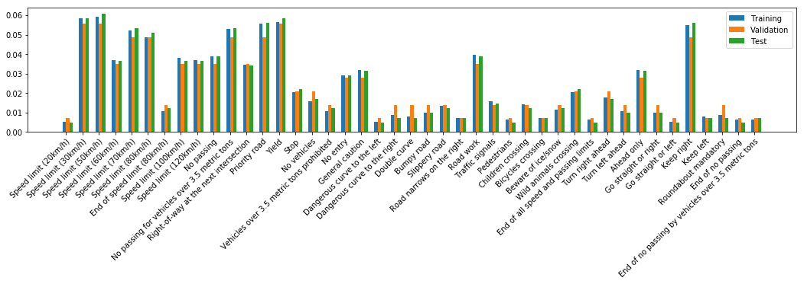
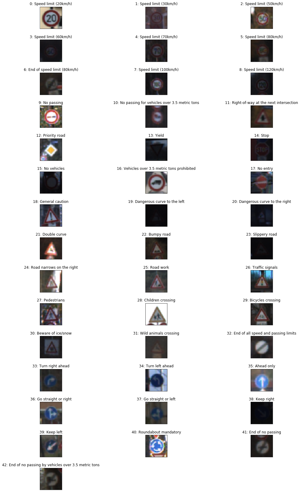
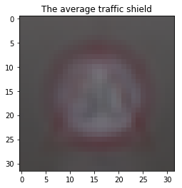
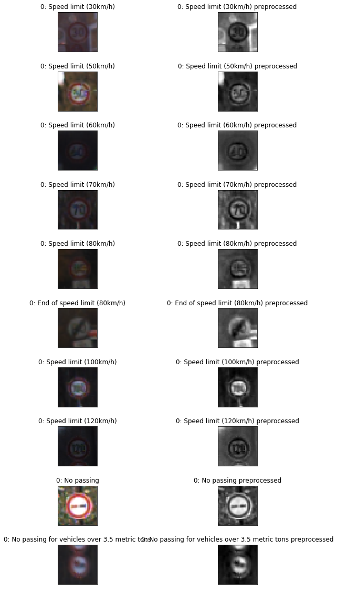
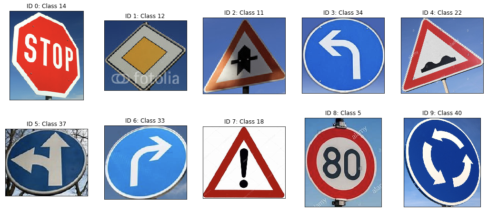
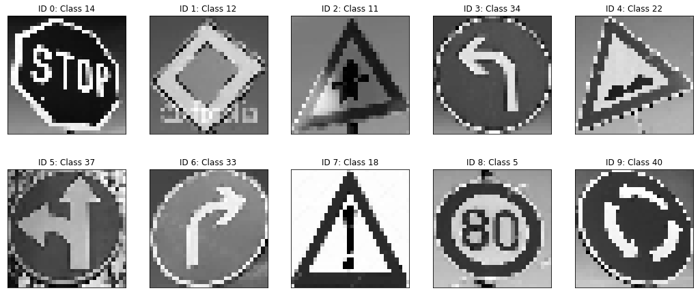
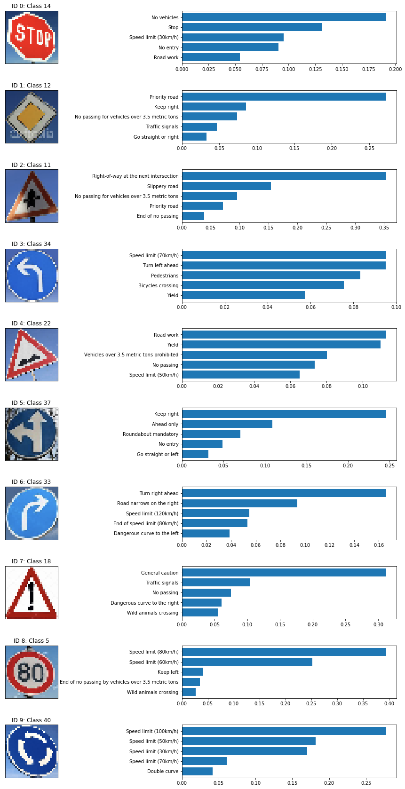

# Self-Driving Car Engineer Nanodegree

## Deep Learning

## Project: Build a Traffic Sign Recognition Classifier

In this notebook, a template is provided for you to implement your functionality in stages, which is required to successfully complete this project. If additional code is required that cannot be included in the notebook, be sure that the Python code is successfully imported and included in your submission if necessary. 

> **Note**: Once you have completed all of the code implementations, you need to finalize your work by exporting the iPython Notebook as an HTML document. Before exporting the notebook to html, all of the code cells need to have been run so that reviewers can see the final implementation and output. You can then export the notebook by using the menu above and navigating to  \n",
    "**File -> Download as -> HTML (.html)**. Include the finished document along with this notebook as your submission. 

In addition to implementing code, there is a writeup to complete. The writeup should be completed in a separate file, which can be either a markdown file or a pdf document. There is a [write up template](https://github.com/udacity/CarND-Traffic-Sign-Classifier-Project/blob/master/writeup_template.md) that can be used to guide the writing process. Completing the code template and writeup template will cover all of the [rubric points](https://review.udacity.com/#!/rubrics/481/view) for this project.

The [rubric](https://review.udacity.com/#!/rubrics/481/view) contains "Stand Out Suggestions" for enhancing the project beyond the minimum requirements. The stand out suggestions are optional. If you decide to pursue the "stand out suggestions", you can include the code in this Ipython notebook and also discuss the results in the writeup file.


>**Note:** Code and Markdown cells can be executed using the **Shift + Enter** keyboard shortcut. In addition, Markdown cells can be edited by typically double-clicking the cell to enter edit mode.

* Load the data set
* Explore, summarize and visualize the data set
* Design, train and test a model architecture
* Use the model to make predictions on new images
* Analyze the softmax probabilities of the new images
* Summarize the results with a written report

(http://benchmark.ini.rub.de/?section=gtsrb&subsection=dataset)

---
## Step 0: Load The Data

---

## Step 1: Dataset Summary & Exploration

The pickled data is a dictionary with 4 key/value pairs:

- `'features'` is a 4D array containing raw pixel data of the traffic sign images, (num examples, width, height, channels).
- `'labels'` is a 1D array containing the label/class id of the traffic sign. The file `signnames.csv` contains id -> name mappings for each id.
- `'sizes'` is a list containing tuples, (width, height) representing the original width and height the image.
- `'coords'` is a list containing tuples, (x1, y1, x2, y2) representing coordinates of a bounding box around the sign in the image. **THESE COORDINATES ASSUME THE ORIGINAL IMAGE. THE PICKLED DATA CONTAINS RESIZED VERSIONS (32 by 32) OF THESE IMAGES**

Complete the basic data summary below. Use python, numpy and/or pandas methods to calculate the data summary rather than hard coding the results. For example, the [pandas shape method](http://pandas.pydata.org/pandas-docs/stable/generated/pandas.DataFrame.shape.html) might be useful for calculating some of the summary results. 


```python
# Load pickled data
import pickle
import os

dirpath = os.getcwd()
foldername = os.path.basename(dirpath)

training_file = dirpath + "/data/train.p"
validation_file= dirpath + "/data/valid.p"
testing_file = dirpath + "/data/test.p"

with open(training_file, mode='rb') as f:
    train = pickle.load(f)
with open(validation_file, mode='rb') as f:
    valid = pickle.load(f)
with open(testing_file, mode='rb') as f:
    test = pickle.load(f)
    
X_train, y_train = train['features'], train['labels']
X_valid, y_valid = valid['features'], valid['labels']
X_test, y_test = test['features'], test['labels']
```

### Provide a Basic Summary of the Data Set Using Python, Numpy and/or Pandas

#### Load the names of y labels


```python
import pandas as pd
sign_data = pd.read_csv('signnames.csv')
```


```python
import numpy as np

### Replace each question mark with the appropriate value. 
### Use python, pandas or numpy methods rather than hard coding the results

n_train = len(X_train)

n_validation = len(X_valid)

n_test = len(X_test)

image_shape = X_test.shape[1:3]

distinct_classes = set(np.hstack((y_test, y_valid, y_train)))
n_classes = len(distinct_classes)
max_class = max(distinct_classes)

print("Number of training examples =", n_train)
print("Number of testing examples =", n_test)
print("Image data shape =", image_shape)
print("Number of classes =", n_classes)
print("Highest class =", max_class)

print("Names of traffic signs:")
print(sign_data["SignName"])
```

    Number of training examples = 34799
    Number of testing examples = 12630
    Image data shape = (32, 32)
    Number of classes = 43
    Highest class = 42
    Names of traffic signs:
    0                                  Speed limit (20km/h)
    1                                  Speed limit (30km/h)
    2                                  Speed limit (50km/h)
    3                                  Speed limit (60km/h)
    4                                  Speed limit (70km/h)
    5                                  Speed limit (80km/h)
    6                           End of speed limit (80km/h)
    7                                 Speed limit (100km/h)
    8                                 Speed limit (120km/h)
    9                                            No passing
    10         No passing for vehicles over 3.5 metric tons
    11                Right-of-way at the next intersection
    12                                        Priority road
    13                                                Yield
    14                                                 Stop
    15                                          No vehicles
    16             Vehicles over 3.5 metric tons prohibited
    17                                             No entry
    18                                      General caution
    19                          Dangerous curve to the left
    20                         Dangerous curve to the right
    21                                         Double curve
    22                                           Bumpy road
    23                                        Slippery road
    24                            Road narrows on the right
    25                                            Road work
    26                                      Traffic signals
    27                                          Pedestrians
    28                                    Children crossing
    29                                    Bicycles crossing
    30                                   Beware of ice/snow
    31                                Wild animals crossing
    32                  End of all speed and passing limits
    33                                     Turn right ahead
    34                                      Turn left ahead
    35                                           Ahead only
    36                                 Go straight or right
    37                                  Go straight or left
    38                                           Keep right
    39                                            Keep left
    40                                 Roundabout mandatory
    41                                    End of no passing
    42    End of no passing by vehicles over 3.5 metric ...
    Name: SignName, dtype: object


### Include an exploratory visualization of the dataset

Visualize the German Traffic Signs Dataset using the pickled file(s). This is open ended, suggestions include: plotting traffic sign images, plotting the count of each sign, etc. 

The [Matplotlib](http://matplotlib.org/) [examples](http://matplotlib.org/examples/index.html) and [gallery](http://matplotlib.org/gallery.html) pages are a great resource for doing visualizations in Python.

**NOTE:** It's recommended you start with something simple first. If you wish to do more, come back to it after you've completed the rest of the sections. It can be interesting to look at the distribution of classes in the training, validation and test set. Is the distribution the same? Are there more examples of some classes than others?

#### Check for balanced classes


```python
import matplotlib.pyplot as plt
import numpy as np
%matplotlib inline

data_set_charts = map(lambda data_set: np.histogram(data_set, n_classes, density=True)[0], [y_train, y_valid, y_test])
data_set_labels = ["Training", "Validation", "Test"]

names = list(sign_data["SignName"])

fig = plt.figure(figsize=(18,3))
ax = plt.subplot(111)

# Position and width of the bars
width=0.2
bins = list(map(lambda x: x-width/2,range(1,n_classes+1)))

# Plot the bar charts next to each other
for i, data in enumerate(data_set_charts):
    ax.bar(np.add(bins,i*width), data, width=width, label=data_set_labels[i])

# Add the x_tick labels
ax.set_xticks(list(map(lambda x: x, range(1,len(data)+1))))
ax.set_xticklabels(names,rotation=45, rotation_mode="anchor", ha="right")

plt.legend()
plt.show()
```





From the bar chart we see, that the number of samples is not balanced across the different classes. This may lead to a biased classificator. Remedy could be to collect more data for the underrepresented classes.

Comparing Test, Valid and Train data set are not quite equal, too. Some classes are under- or overrepresented compared to the other data sets.

#### Display a sample for each class


```python
import matplotlib.pyplot as plt
fig = plt.figure(figsize=(18,40))
fig.subplots_adjust(hspace=0.5)

for i in range(n_classes):
    pic_id = np.min(np.where(y_train==i))
    plt.subplot(20, 3, i+1), plt.xticks([]), plt.yticks([]),
    plt.title("{}: {}".format(i, sign_data.iloc[i]["SignName"])),
    plt.imshow(X_train[pic_id])

plt.show()
```





#### The average image on the training data


```python
### Data exploration visualization code goes here.
### Feel free to use as many code cells as needed.
import matplotlib.pyplot as plt
%matplotlib inline

mu = np.mean(X_test,axis=0)
std = np.std(X_test, axis=0)
plt.imshow(mu.astype(int)), plt.title("The average traffic shield"), plt.show()
```





    (<matplotlib.image.AxesImage at 0x11dfef9e8>,
     Text(0.5, 1.0, 'The average traffic shield'),
     None)


The average image shows the bias in the training data, too. For example there are less blue signs, leading to the prevailing red in the average image.

----

## Step 2: Design and Test a Model Architecture

Design and implement a deep learning model that learns to recognize traffic signs. Train and test your model on the [German Traffic Sign Dataset](http://benchmark.ini.rub.de/?section=gtsrb&subsection=dataset).

The LeNet-5 implementation shown in the [classroom](https://classroom.udacity.com/nanodegrees/nd013/parts/fbf77062-5703-404e-b60c-95b78b2f3f9e/modules/6df7ae49-c61c-4bb2-a23e-6527e69209ec/lessons/601ae704-1035-4287-8b11-e2c2716217ad/concepts/d4aca031-508f-4e0b-b493-e7b706120f81) at the end of the CNN lesson is a solid starting point. You'll have to change the number of classes and possibly the preprocessing, but aside from that it's plug and play! 

With the LeNet-5 solution from the lecture, you should expect a validation set accuracy of about 0.89. To meet specifications, the validation set accuracy will need to be at least 0.93. It is possible to get an even higher accuracy, but 0.93 is the minimum for a successful project submission. 

There are various aspects to consider when thinking about this problem:

- Neural network architecture (is the network over or underfitting?)
- Play around preprocessing techniques (normalization, rgb to grayscale, etc)
- Number of examples per label (some have more than others).
- Generate fake data.

Here is an example of a [published baseline model on this problem](http://yann.lecun.com/exdb/publis/pdf/sermanet-ijcnn-11.pdf). It's not required to be familiar with the approach used in the paper but, it's good practice to try to read papers like these.

### Pre-process the Data Set (normalization, grayscale, etc.)

Minimally, the image data should be normalized so that the data has mean zero and equal variance. For image data, `(pixel - 128)/ 128` is a quick way to approximately normalize the data and can be used in this project. 

Other pre-processing steps are optional. You can try different techniques to see if it improves performance. 

Use the code cell (or multiple code cells, if necessary) to implement the first step of your project.

#### Define methods for batching and normalizing the data sets


```python
### Preprocess the data here. It is required to normalize the data. Other preprocessing steps could include 
### converting to grayscale, etc.
### Feel free to use as many code cells as needed.

import cv2 
import tensorflow as tf

def next_batch(_X, _y, batch_size=1000):
    assert len(_X) == len(_y)
    l = len(_X)
    for i in range(0, len(_X), batch_size):
        yield _X[i:min(i+batch_size, l)], _y[i:min(i+batch_size, l)]

def normalize_per_set(_img_arr):
    mu = np.mean(_img_arr,axis=0)
    std = np.std(_img_arr, axis=0)
    out = (_img_arr - mu) / std
    return out

# grayscale
def grayscale(_img):
    res = cv2.cvtColor(_img, cv2.COLOR_BGR2GRAY)
    return res

# normalize the data
def normalize_per_img(_img):
    # TODO shall be done on a batch of images
    mu = np.mean(_img)
    std = np.std(_img)
    out = (_img - mu) / std
    return out

# preprocessing pipeline for training data set
def pipeline(_img_stack):
    step1 = list(map(grayscale, _img_stack))
    step2 = normalize_per_set(step1)
    return step2

# preprocessing pipeline2 for prediction
def pipeline2(_img_stack):
    step1 = list(map(grayscale, _img_stack))
    step2 = [normalize_per_img(i) for i in step1]
    return step2

X_test_preproc = pipeline(X_test)
X_train_preproc = pipeline(X_train)
X_valid_preproc = pipeline(X_valid)
```

#### Display samples of normalized images to understand the processing steps


```python
# import matplotlib.pyplot as plt
fig = plt.figure(figsize=(10,20))
fig.subplots_adjust(hspace=0.5)

pics_per_row = 2
num_pics = 10

pic_counter = 1
# Only for the first num_pics classes
for class_id in range(1,num_pics+1):
    
    pic_id = np.min(np.where(y_train==class_id))
    
    # Original image
    plt.subplot(num_pics, pics_per_row, pic_counter), plt.xticks([]), plt.yticks([])
    plt.title("{}: {}".format(i, sign_data.iloc[class_id]["SignName"])),
    pic_counter += 1
    plt.imshow(X_train[pic_id])
    plt.plot()
    
    # Preprocessed counter-part image
    plt.subplot(num_pics, pics_per_row, pic_counter), plt.xticks([]), plt.yticks([])
    plt.title("{}: {} preprocessed".format(i, sign_data.iloc[class_id]["SignName"])),
    pic_counter += 1
    plt.imshow(X_train_preproc[pic_id], "gray")
    plt.plot()
```





### Model Architecture

I decided to build the model with Tensorflow core, to better understand the internal mechanics of the neural network. For reasons of simplicity, it could also be done with high level layers of the framework.

#### Functions to construct the layers of the ConvNet


```python
import tensorflow as tf

"""
Weights and biases variables and placeholders
"""                 
W_dict = {}
b_dict = {}

"""
Functions to build up the conv net.
"""               
def add_conv2d_layer(x_, cnt_out, name, kernel=5, stride=1, padding="SAME"):
    with tf.name_scope(name):
        # Check input
        _, h_i, w_i, lyrs_i = x_.shape.as_list()
        
        # Weights and biases matrix
        #W = tf.Variable(tf.random_normal([kernel, kernel, lyrs_i, cnt_out]), name=name + "_W")
        W = tf.get_variable(name + "_W", shape=(kernel, kernel, lyrs_i, cnt_out), \
            initializer=tf.contrib.layers.xavier_initializer())
        #b = tf.Variable(tf.random_normal([cnt_out]), name=name + "_b")
        b = tf.get_variable(name=name + "_b", shape=(cnt_out), initializer=tf.zeros_initializer())
        W_dict[W.name] = W
        b_dict[b.name] = b
        
        # Construction
        out = tf.nn.conv2d(x_, W, strides=[1, stride, stride, 1], padding=padding)
        out = tf.add(out, b)
        out = tf.nn.relu(out)
        
        _, h_o, w_o, lyrs_o = out.shape.as_list()
        print("Conv2d\t\t{}\t\twith shape {}".format(name, out.shape.as_list()))
        out = tf.identity(out, name="final_out")
        return out
                   
def add_avg_pooling_layer(x, name, kernel=2, stride=1):
    with tf.name_scope(name):
        out = tf.nn.avg_pool(x, ksize=[1, kernel, kernel, 1], strides=[1, stride, stride, 1], padding="SAME")
        print("Avg Pool\t{}\t\twith shape {}".format(name, out.shape.as_list()))
        out = tf.identity(out, name="final_out")
        return out

def flatten_feature_maps(x_, name):
    with tf.name_scope(name):
        # Check input
        _, h_i, w_i, lyrs_i = x_.shape.as_list()
        out = tf.reshape(x_, [-1, h_i * w_i * lyrs_i])
        print("Flatten\t\t{}\twith shape {}".format(name, out.shape.as_list()))
        out = tf.identity(out, name="final_out")
        return out
    
def add_fully_connected_layer(x_, cnt_out, name, keep_prob=1., apply_relu=True):
    # If applied after connected layer, reshape is necessary!
    with tf.name_scope(name):
        # Check input
        _, featurs_i = x_.shape.as_list()
        
        # Weights and biases matrix with He initialization
        #W = tf.Variable(tf.random_normal([featurs_i, cnt_out],
        #                                name=name + "_W"))
        W = tf.get_variable(name + "_W", shape=(featurs_i, cnt_out), 
            initializer=tf.contrib.layers.xavier_initializer())
        #b = tf.Variable(tf.random_normal([cnt_out]), name=name + "_b")
        b = tf.get_variable(name + "_b", shape=(cnt_out), initializer=tf.zeros_initializer())
        W_dict[W.name] = W
        b_dict[b.name] = b
        
        # Matmul order due due row * column, i.e. height of W = number of inbound
        out = tf.add(tf.matmul(x_, W), b)
        
        # Optional drop out - deactivated by default
        out = tf.nn.dropout(out, rate= 1 - keep_prob)
        
        # Batch normalization
        # Small epsilon value for the BN transform
        epsilon = 1e-3
        batch_mean1, batch_var1 = tf.nn.moments(out,[0])
        z1_hat = (out - batch_mean1) / tf.sqrt(batch_var1 + epsilon)
        scale1 = tf.Variable(tf.ones([cnt_out]))
        beta1 = tf.Variable(tf.zeros([cnt_out]))
        out = scale1 * z1_hat + beta1
        
        # Optional ReLU
        if apply_relu:
            out = tf.nn.relu(out)
        print("Fully Connected\t{}\t\twith shape {}".format(name, out.shape.as_list()))
        out = tf.identity(out, name="final_out")
        return out
    

```

#### Construction of the ConvNet based on the LeNet model

The model is built up using the helper functions defined above. Clear names are assigned to tensors and operations, so that the model can be loaded and used for making predictions later on.


```python
"""
Network construction
"""
tf.reset_default_graph()

CONST_keep_prob = tf.placeholder(tf.float32, name="keep_prob")

# In: Input layer
height = image_shape[1]
width = image_shape[0]
channels = 1
X = tf.placeholder(tf.float32, shape=(None, height, width), name="X")
# Shall be read in as one hot encoded label vector
y = tf.placeholder(tf.int32, shape=(None), name="y")

# Reshape needed for conv layers to work
inpt = tf.reshape(X, [-1, width, height, 1])
print(inpt.shape.as_list())
                     
# C1: Convolution
c1 = add_conv2d_layer(inpt, cnt_out=6, name="C1", kernel=5, stride=1)
                   
# S2: Avg Pooling. 
s2 = add_avg_pooling_layer(c1, name="S2", kernel=2, stride=1)

# C3: Convolution.
c3 = add_conv2d_layer(s2, cnt_out=16, name="C3", kernel=5, stride=1)

# S4: Avg Pooling. h*w/2
s4 = add_avg_pooling_layer(c3, "S4", kernel=2, stride=2)

# C5: Convolution
c5 = add_conv2d_layer(s4, cnt_out=120, name="C5", kernel=5, stride=1)

# F6: Fully Connected
flattend_c5 = flatten_feature_maps(c5, name="C5_flatten")
f6 = add_fully_connected_layer(flattend_c5, cnt_out=84, name="F6", keep_prob=CONST_keep_prob, apply_relu=True)

# Out: Fully Connected. Keep_prob kept static
out = add_fully_connected_layer(f6, n_classes, name="Out", keep_prob=1.0, apply_relu=False)

# Create a loss function based on cross entropy
with tf.name_scope("loss"):
    xentropy = tf.nn.sparse_softmax_cross_entropy_with_logits(logits=out, labels=y)
    loss = tf.reduce_mean(xentropy)

with tf.name_scope("train"):
    initial_learning_rate = 0.001
    optimizer = tf.train.AdamOptimizer(initial_learning_rate)
    train_op = optimizer.minimize(loss)#=global_step)
    
with tf.name_scope("eval"):
    correct = tf.nn.in_top_k(out, y, 1)
    accuracy = tf.reduce_mean(tf.cast(correct, tf.float32), name="accuracy")
    
with tf.name_scope("prediction"):
    pred = tf.nn.softmax(out, name="predictor")
    probabilities = tf.nn.softmax(out, name="softmax")
    top5 = tf.math.top_k(
        probabilities,
        k=5,
        sorted=True,
        name="top5"
    )

init = tf.global_variables_initializer()
saver = tf.train.Saver()
```

    [None, 32, 32, 1]
    Conv2d		C1		with shape [None, 32, 32, 6]
    Avg Pool	S2		with shape [None, 32, 32, 6]
    Conv2d		C3		with shape [None, 32, 32, 16]
    Avg Pool	S4		with shape [None, 16, 16, 16]
    Conv2d		C5		with shape [None, 16, 16, 120]
    Flatten		C5_flatten	with shape [None, 30720]
    Fully Connected	F6		with shape [None, 84]
    Fully Connected	Out		with shape [None, 43]


### Train, Validate and Test the Model

A validation set can be used to assess how well the model is performing. A low accuracy on the training and validation
sets imply underfitting. A high accuracy on the training set but low accuracy on the validation set implies overfitting.


```python
### Train your model here.
### Calculate and report the accuracy on the training and validation set.
### Once a final model architecture is selected, 
### the accuracy on the test set should be calculated and reported as well.
### Feel free to use as many code cells as needed.
from ipywidgets import IntProgress
from IPython.display import display
from sklearn.utils import shuffle

n_epochs = 5
_batch_size = 1000
_keep_prob = 0.5
with tf.Session() as sess:
    saver = tf.train.import_meta_graph("saved_models/traffic_sign_classifier.meta")
    saver.restore(sess, "saved_models/traffic_sign_classifier")
    #init.run()
    for epoch in range(1, n_epochs+1):
        print("Starting epoch ", epoch,"/",n_epochs)
        cur_X, cur_y = shuffle(X_train_preproc, y_train)
        f = IntProgress(min=0, max=len(X_train_preproc)//_batch_size) # instantiate the bar
        display(f) # display the bar
        
        for _X, _y in next_batch(cur_X, cur_y, batch_size=_batch_size):
            sess.run([train_op], feed_dict={X: _X, y: _y, CONST_keep_prob: _keep_prob})
            f.value += 1
        acc_train, loss_train = sess.run([accuracy, loss], feed_dict={X: X_train_preproc, y: y_train, CONST_keep_prob: 1.0})
        acc_valid, loss_valid = sess.run([accuracy, loss], feed_dict={X: X_valid_preproc, y: y_valid, CONST_keep_prob: 1.0})
        
        print(epoch, "Train data set accuracy:\t", acc_train, "\tloss:", loss_train)
        print(epoch, "Valid data set accuracy:\t", acc_valid, "\tloss:", loss_valid)
        
        if epoch % 5 == 0:
            print("saving model...")
            save_path = saver.save(sess, "saved_models/traffic_sign_classifier", global_step=epoch)
        print("-"*20)
    save_path = saver.save(sess, "saved_models/traffic_sign_classifier")
```

    INFO:tensorflow:Restoring parameters from saved_models/traffic_sign_classifier
    Starting epoch  1 / 5


    IntProgress(value=0, max=34)


    1 Train data set accuracy:	 0.9999713 	loss: 0.06755317
    1 Valid data set accuracy:	 0.96575963 	loss: 0.26985133
    --------------------
    Starting epoch  2 / 5


    IntProgress(value=0, max=34)


    2 Train data set accuracy:	 0.9999713 	loss: 0.058665134
    2 Valid data set accuracy:	 0.96507937 	loss: 0.25523484
    --------------------
    Starting epoch  3 / 5


    IntProgress(value=0, max=34)


    3 Train data set accuracy:	 0.9999713 	loss: 0.052567605
    3 Valid data set accuracy:	 0.9675737 	loss: 0.2387284
    --------------------
    Starting epoch  4 / 5


    IntProgress(value=0, max=34)


    4 Train data set accuracy:	 0.9999713 	loss: 0.04691969
    4 Valid data set accuracy:	 0.96303856 	loss: 0.23947959
    --------------------
    Starting epoch  5 / 5


    IntProgress(value=0, max=34)


    5 Train data set accuracy:	 1.0 	loss: 0.042564236
    5 Valid data set accuracy:	 0.96666664 	loss: 0.22574109
    saving model...
    --------------------


#### Final Test Accuracy


```python
tf.reset_default_graph()
with tf.Session() as sess:
    
    saver = tf.train.import_meta_graph("saved_models/traffic_sign_classifier.meta")
    saver.restore(sess, "saved_models/traffic_sign_classifier")
    graph = tf.get_default_graph()

    _x = graph.get_tensor_by_name("X:0")
    _keep_prob = graph.get_tensor_by_name("keep_prob:0")

    feed_dict = {_x: X_test, _keep_prob: 1.0}
    
    acc_op = graph.get_tensor_by_name("eval/accuracy:0")
    acc_test = sess.run([acc_op], feed_dict)
        
    print(epoch, "Test data set accuracy:\t", acc_test)
```

    INFO:tensorflow:Restoring parameters from saved_models/traffic_sign_classifier


    ---------------------------------------------------------------------------

    KeyError                                  Traceback (most recent call last)

    <ipython-input-279-7ba14ab382b5> in <module>
         11     feed_dict = {_x: X_test, _keep_prob: 1.0}
         12 
    ---> 13     acc_op = graph.get_tensor_by_name("eval/accuracy:0")
         14     acc_test = sess.run([acc_op], feed_dict)
         15 


    /Applications/anaconda3/lib/python3.7/site-packages/tensorflow/python/framework/ops.py in get_tensor_by_name(self, name)
       3652       raise TypeError("Tensor names are strings (or similar), not %s." %
       3653                       type(name).__name__)
    -> 3654     return self.as_graph_element(name, allow_tensor=True, allow_operation=False)
       3655 
       3656   def _get_tensor_by_tf_output(self, tf_output):


    /Applications/anaconda3/lib/python3.7/site-packages/tensorflow/python/framework/ops.py in as_graph_element(self, obj, allow_tensor, allow_operation)
       3476 
       3477     with self._lock:
    -> 3478       return self._as_graph_element_locked(obj, allow_tensor, allow_operation)
       3479 
       3480   def _as_graph_element_locked(self, obj, allow_tensor, allow_operation):


    /Applications/anaconda3/lib/python3.7/site-packages/tensorflow/python/framework/ops.py in _as_graph_element_locked(self, obj, allow_tensor, allow_operation)
       3518           raise KeyError("The name %s refers to a Tensor which does not "
       3519                          "exist. The operation, %s, does not exist in the "
    -> 3520                          "graph." % (repr(name), repr(op_name)))
       3521         try:
       3522           return op.outputs[out_n]


    KeyError: "The name 'eval/accuracy:0' refers to a Tensor which does not exist. The operation, 'eval/accuracy', does not exist in the graph."


---

## Step 3: Test a Model on New Images

To give yourself more insight into how your model is working, download at least five pictures of German traffic signs from the web and use your model to predict the traffic sign type.

You may find `signnames.csv` useful as it contains mappings from the class id (integer) to the actual sign name.

### Load and Output the Images

#### Importing the custom files and assigning labels


```python
### Load the images and plot them here.
### Feel free to use as many code cells as needed.
import matplotlib.image as mpimg
import glob

filenames = glob.glob("web_pictures/*.png")
print(filenames)

y_web_labels = {
    'web_pictures/14.png':14,
     'web_pictures/12.png':12,
     'web_pictures/11.png':11,
     'web_pictures/34.png':34,
     'web_pictures/22.png':22,
     'web_pictures/37.png':37,
     'web_pictures/33.png':33,
     'web_pictures/18.png':18,
     'web_pictures/5.png':5,
     'web_pictures/40.png':40
}

X_web = []
y_web = []

for filename in filenames:
    img = mpimg.imread(filename)
    X_web.append(img)
    y_web.append(y_web_labels[filename])

```

    ['web_pictures/14.png', 'web_pictures/12.png', 'web_pictures/11.png', 'web_pictures/34.png', 'web_pictures/22.png', 'web_pictures/37.png', 'web_pictures/33.png', 'web_pictures/18.png', 'web_pictures/5.png', 'web_pictures/40.png']


#### Display the imported custom files with their labels


```python
fig = plt.figure(figsize=(18,20))
#fig.subplots_adjust(hspace=0.5)

for i in range(len(X_web)):
    plt.subplot(5, 5, i+1), plt.xticks([]), plt.yticks([]),
    plt.title("ID {}: Class {}".format(i, y_web[i])),
    plt.imshow(X_web[i])

plt.show()
```





#### Preprocess the imported custom files

Contrary to the standardization on axis 3 in the preprocessing of the batches for training, test and validation, the normalization of these images is done normalizing each pixel by ```(pxl - 128)/128```


```python
# Preprocess
X_web = list(map(lambda l: cv2.resize(l, (32, 32)), X_web))
X_web_preproc = pipeline2(X_web)

for img in X_web_preproc:
    print("min {} max {}".format(np.min(img), np.max(img)))
```

    min -0.9685932993888855 max 1.9034367799758911
    min -2.353837490081787 max 2.250343084335327
    min -2.1787075996398926 max 3.044407367706299
    min -1.8324922323226929 max 2.907470941543579
    min -2.5368776321411133 max 1.98388671875
    min -1.8557415008544922 max 2.3633551597595215
    min -2.6870944499969482 max 2.3908517360687256
    min -1.8520991802215576 max 0.722054123878479
    min -2.0856616497039795 max 1.6902447938919067
    min -1.4591835737228394 max 1.8559510707855225


```python
fig = plt.figure(figsize=(18,20))

for i in range(len(X_web_preproc)):
    plt.subplot(5, 5, i+1), plt.xticks([]), plt.yticks([]),
    plt.title("ID {}: Class {}".format(i, y_web[i])),
    plt.imshow(X_web_preproc[i], "gray")

plt.show()
```





### Predict the Sign Type for Each Image


```python
### Run the predictions here and use the model to output the prediction for each image.
### Make sure to pre-process the images with the same pre-processing pipeline used earlier.
### Feel free to use as many code cells as needed.

tf.reset_default_graph()
with tf.Session() as sess:
    
    saver = tf.train.import_meta_graph("saved_models/traffic_sign_classifier.meta")
    saver.restore(sess, "saved_models/traffic_sign_classifier")
    graph = tf.get_default_graph()

    _x = graph.get_tensor_by_name("X:0")
    _keep_prob = graph.get_tensor_by_name("keep_prob:0")

    feed_dict = {_x: X_web_preproc, _keep_prob: 1.0}

    predictor = graph.get_tensor_by_name("prediction/predictor:0")
    predictions = list(sess.run(tf.argmax(predictor, axis=1), feed_dict))
    
    is_correct = list(map(lambda t: 1 if t[0] == t[1] else 0, zip(predictions, y_web)))
    sum_correct = np.sum(is_correct)
for i, (y_true, y_pred) in enumerate(zip(y_web, predictions)):
    print("Image {}".format(i))
    print("LABEL id={}\t{}".format(y_true, sign_data["SignName"][y_true]))
    print("PRED  id={}\t{}".format(y_pred, sign_data["SignName"][y_pred]))
    print("==> CORRECT" if is_correct[i] else "==> WRONG")
    print("-"*10)
```

    INFO:tensorflow:Restoring parameters from saved_models/traffic_sign_classifier
    Image 0
    LABEL id=14	Stop
    PRED  id=15	No vehicles
    ==> WRONG
    ----------
    Image 1
    LABEL id=12	Priority road
    PRED  id=12	Priority road
    ==> CORRECT
    ----------
    Image 2
    LABEL id=11	Right-of-way at the next intersection
    PRED  id=11	Right-of-way at the next intersection
    ==> CORRECT
    ----------
    Image 3
    LABEL id=34	Turn left ahead
    PRED  id=4	Speed limit (70km/h)
    ==> WRONG
    ----------
    Image 4
    LABEL id=22	Bumpy road
    PRED  id=25	Road work
    ==> WRONG
    ----------
    Image 5
    LABEL id=37	Go straight or left
    PRED  id=38	Keep right
    ==> WRONG
    ----------
    Image 6
    LABEL id=33	Turn right ahead
    PRED  id=33	Turn right ahead
    ==> CORRECT
    ----------
    Image 7
    LABEL id=18	General caution
    PRED  id=18	General caution
    ==> CORRECT
    ----------
    Image 8
    LABEL id=5	Speed limit (80km/h)
    PRED  id=5	Speed limit (80km/h)
    ==> CORRECT
    ----------
    Image 9
    LABEL id=40	Roundabout mandatory
    PRED  id=7	Speed limit (100km/h)
    ==> WRONG
    ----------


### Analyze Performance


```python
accuracy = sum_correct / len(y_web)
print("Model accuracy on web data is {}%".format(accuracy * 100.))
```

    Model accuracy on web data is 50.0%


# Calculate the accuracy for these 5 new images. 
### For example, if the model predicted 1 out of 5 signs correctly, it's 20% accurate on these new images.

### Output Top 5 Softmax Probabilities For Each Image Found on the Web

For each of the new images, print out the model's softmax probabilities to show the **certainty** of the model's predictions (limit the output to the top 5 probabilities for each image). [`tf.nn.top_k`](https://www.tensorflow.org/versions/r0.12/api_docs/python/nn.html#top_k) could prove helpful here. 

The example below demonstrates how tf.nn.top_k can be used to find the top k predictions for each image.

`tf.nn.top_k` will return the values and indices (class ids) of the top k predictions. So if k=3, for each sign, it'll return the 3 largest probabilities (out of a possible 43) and the correspoding class ids.

Take this numpy array as an example. The values in the array represent predictions. The array contains softmax probabilities for five candidate images with six possible classes. `tf.nn.top_k` is used to choose the three classes with the highest probability:

```
# (5, 6) array
a = np.array([[ 0.24879643,  0.07032244,  0.12641572,  0.34763842,  0.07893497,
         0.12789202],
       [ 0.28086119,  0.27569815,  0.08594638,  0.0178669 ,  0.18063401,
         0.15899337],
       [ 0.26076848,  0.23664738,  0.08020603,  0.07001922,  0.1134371 ,
         0.23892179],
       [ 0.11943333,  0.29198961,  0.02605103,  0.26234032,  0.1351348 ,
         0.16505091],
       [ 0.09561176,  0.34396535,  0.0643941 ,  0.16240774,  0.24206137,
         0.09155967]])
```

Running it through `sess.run(tf.nn.top_k(tf.constant(a), k=3))` produces:

```
TopKV2(values=array([[ 0.34763842,  0.24879643,  0.12789202],
       [ 0.28086119,  0.27569815,  0.18063401],
       [ 0.26076848,  0.23892179,  0.23664738],
       [ 0.29198961,  0.26234032,  0.16505091],
       [ 0.34396535,  0.24206137,  0.16240774]]), indices=array([[3, 0, 5],
       [0, 1, 4],
       [0, 5, 1],
       [1, 3, 5],
       [1, 4, 3]], dtype=int32))
```

Looking just at the first row we get `[ 0.34763842,  0.24879643,  0.12789202]`, you can confirm these are the 3 largest probabilities in `a`. You'll also notice `[3, 0, 5]` are the corresponding indices.


```python
### Print out the top five softmax probabilities for the predictions on the German traffic sign images found on the web. 
### Feel free to use as many code cells as needed.

### Run the predictions here and use the model to output the prediction for each image.
### Make sure to pre-process the images with the same pre-processing pipeline used earlier.
### Feel free to use as many code cells as needed.

tf.reset_default_graph()
with tf.Session() as sess:
    
    saver = tf.train.import_meta_graph("saved_models/traffic_sign_classifier.meta")
    saver.restore(sess, "saved_models/traffic_sign_classifier")
    graph = tf.get_default_graph()

    _x = graph.get_tensor_by_name("X:0")
    _keep_prob = graph.get_tensor_by_name("keep_prob:0")

    feed_dict = {_x: X_web_preproc, _keep_prob: 1.0}

    softmax = graph.get_tensor_by_name("prediction/softmax:0")
    probabilities = sess.run(softmax, feed_dict)
    prob, ind = sess.run(tf.nn.top_k(probabilities,
                k=5,
                sorted=True,
                name="top5"),feed_dict)
```

    INFO:tensorflow:Restoring parameters from saved_models/traffic_sign_classifier


Print the result nicely as a bar chart next to the picture.


```python
import matplotlib.pyplot as plt
import numpy as np
%matplotlib inline

fig = plt.figure(figsize=(18,30))
fig.subplots_adjust(hspace=0.5)

pic_count = 1
for i in range(0, len(X_web)):
    # Plot the image
    plt.subplot(len(X_web), 2, pic_count), plt.xticks([]), plt.yticks([]),
    pic_count += 1
    plt.title("ID {}: Class {}".format(i, y_web[i])),
    plt.imshow(X_web[i])
    
    # Plot the prediction
    y_pos = np.arange(5)
    ax = plt.subplot(len(X_web), 2, pic_count)
    plt.xticks([]), plt.yticks([]),
    pic_count += 1
    names = list(map(lambda n: sign_data["SignName"][n], ind[i]))
    ax.barh(y_pos, prob[i])
    ax.set_yticks(y_pos)
    ax.set_yticklabels(names)
    ax.invert_yaxis() 
plt.show()
```





### Project Writeup

Once you have completed the code implementation, document your results in a project writeup using this [template](https://github.com/udacity/CarND-Traffic-Sign-Classifier-Project/blob/master/writeup_template.md) as a guide. The writeup can be in a markdown or pdf file. 

> **Note**: Once you have completed all of the code implementations and successfully answered each question above, you may finalize your work by exporting the iPython Notebook as an HTML document. You can do this by using the menu above and navigating to  \n",
    "**File -> Download as -> HTML (.html)**. Include the finished document along with this notebook as your submission.

---

## Step 4 (Optional): Visualize the Neural Network's State with Test Images

 This Section is not required to complete but acts as an additional excersise for understaning the output of a neural network's weights. While neural networks can be a great learning device they are often referred to as a black box. We can understand what the weights of a neural network look like better by plotting their feature maps. After successfully training your neural network you can see what it's feature maps look like by plotting the output of the network's weight layers in response to a test stimuli image. From these plotted feature maps, it's possible to see what characteristics of an image the network finds interesting. For a sign, maybe the inner network feature maps react with high activation to the sign's boundary outline or to the contrast in the sign's painted symbol.

 Provided for you below is the function code that allows you to get the visualization output of any tensorflow weight layer you want. The inputs to the function should be a stimuli image, one used during training or a new one you provided, and then the tensorflow variable name that represents the layer's state during the training process, for instance if you wanted to see what the [LeNet lab's](https://classroom.udacity.com/nanodegrees/nd013/parts/fbf77062-5703-404e-b60c-95b78b2f3f9e/modules/6df7ae49-c61c-4bb2-a23e-6527e69209ec/lessons/601ae704-1035-4287-8b11-e2c2716217ad/concepts/d4aca031-508f-4e0b-b493-e7b706120f81) feature maps looked like for it's second convolutional layer you could enter conv2 as the tf_activation variable.

For an example of what feature map outputs look like, check out NVIDIA's results in their paper [End-to-End Deep Learning for Self-Driving Cars](https://devblogs.nvidia.com/parallelforall/deep-learning-self-driving-cars/) in the section Visualization of internal CNN State. NVIDIA was able to show that their network's inner weights had high activations to road boundary lines by comparing feature maps from an image with a clear path to one without. Try experimenting with a similar test to show that your trained network's weights are looking for interesting features, whether it's looking at differences in feature maps from images with or without a sign, or even what feature maps look like in a trained network vs a completely untrained one on the same sign image.

<figure>
 
 <figcaption>
 <p></p> 
 <p style="text-align: center;"> Your output should look something like this (above)</p> 
 </figcaption>
</figure>
 <p></p> 


```python
### Visualize your network's feature maps here.
### Feel free to use as many code cells as needed.

# image_input: the test image being fed into the network to produce the feature maps
# tf_activation: should be a tf variable name used during your training procedure that represents the calculated state of a specific weight layer
# activation_min/max: can be used to view the activation contrast in more detail, by default matplot sets min and max to the actual min and max values of the output
# plt_num: used to plot out multiple different weight feature map sets on the same block, just extend the plt number for each new feature map entry

def outputFeatureMap(image_input, tf_activation, activation_min=-1, activation_max=-1 ,plt_num=1):
    # Here make sure to preprocess your image_input in a way your network expects
    # with size, normalization, ect if needed
    # image_input =
    # Note: x should be the same name as your network's tensorflow data placeholder variable
    # If you get an error tf_activation is not defined it may be having trouble accessing the variable from inside a function
    activation = tf_activation.eval(session=sess,feed_dict={x : image_input})
    featuremaps = activation.shape[3]
    plt.figure(plt_num, figsize=(15,15))
    for featuremap in range(featuremaps):
        plt.subplot(6,8, featuremap+1) # sets the number of feature maps to show on each row and column
        plt.title('FeatureMap ' + str(featuremap)) # displays the feature map number
        if activation_min != -1 & activation_max != -1:
            plt.imshow(activation[0,:,:, featuremap], interpolation="nearest", vmin =activation_min, vmax=activation_max, cmap="gray")
        elif activation_max != -1:
            plt.imshow(activation[0,:,:, featuremap], interpolation="nearest", vmax=activation_max, cmap="gray")
        elif activation_min !=-1:
            plt.imshow(activation[0,:,:, featuremap], interpolation="nearest", vmin=activation_min, cmap="gray")
        else:
            plt.imshow(activation[0,:,:, featuremap], interpolation="nearest", cmap="gray")
```


```python

```
